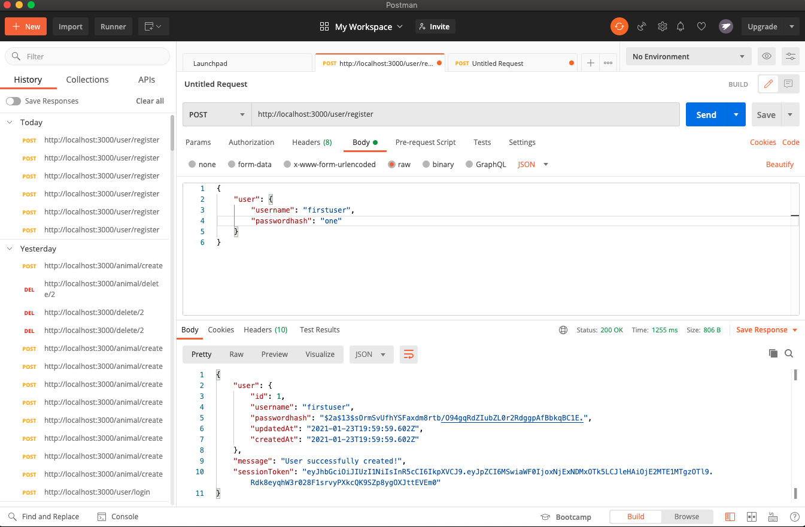
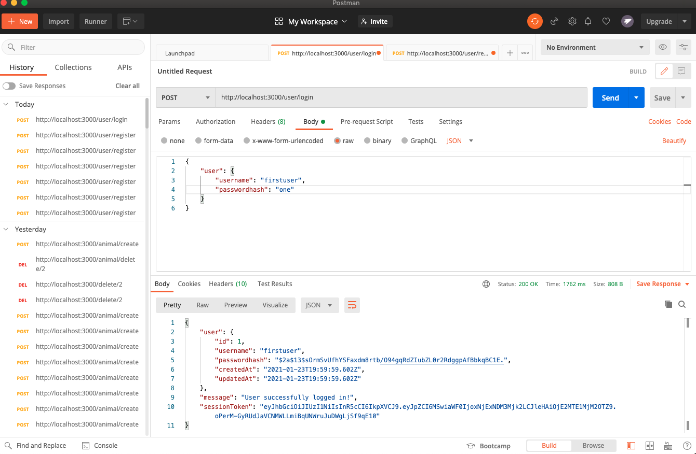
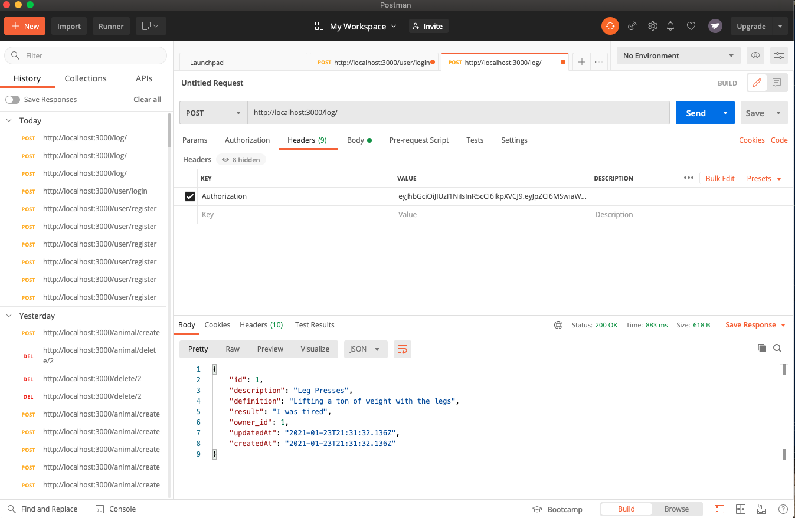
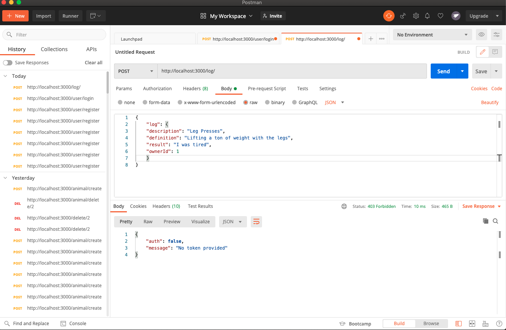
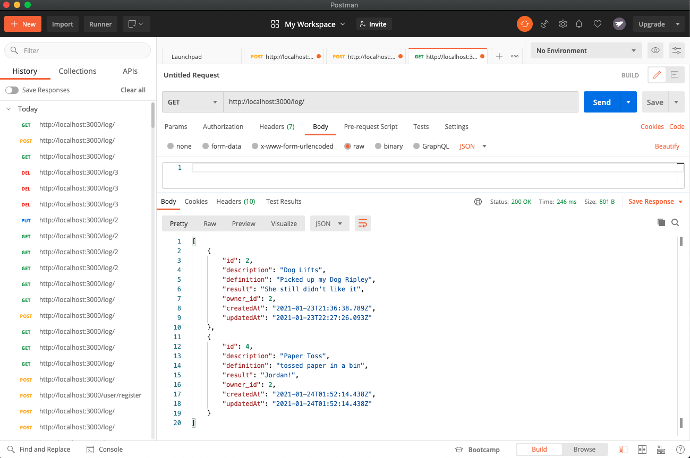
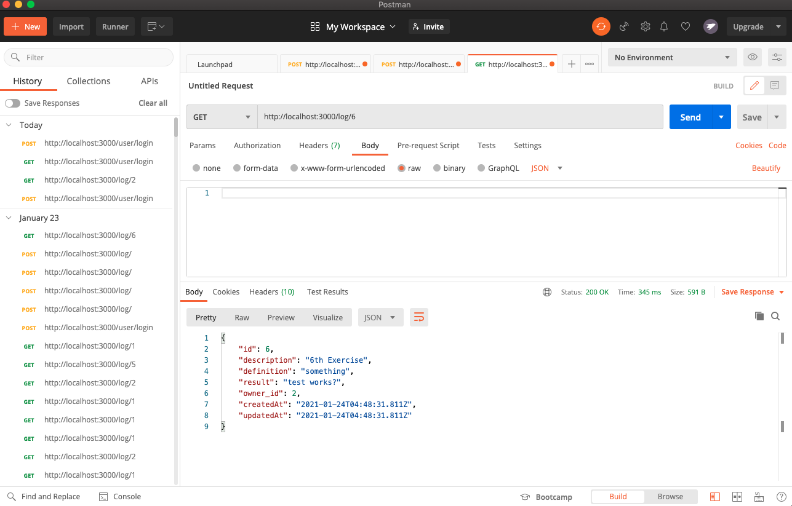
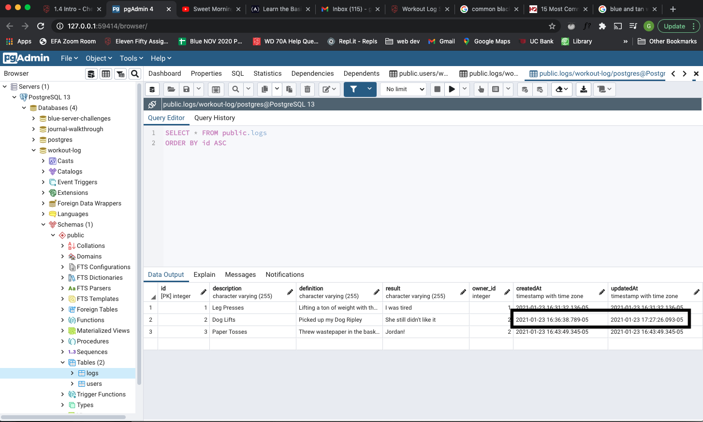
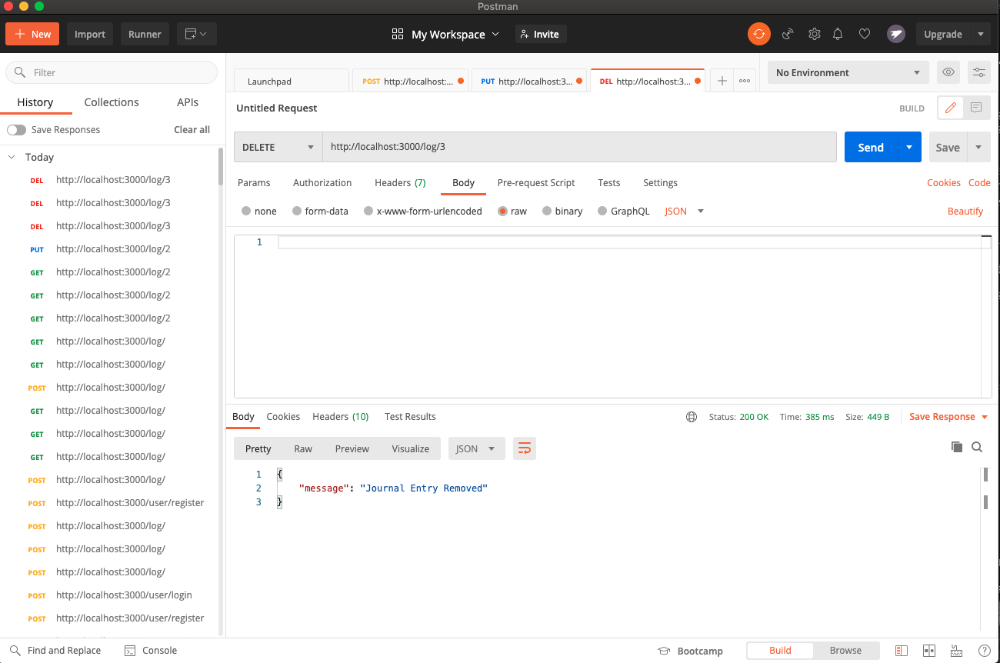

# Workout-Log
This is a local server buildout for a Workout Logbook using Express, Sequelize, Bcrypt, JSONWebToken, and Node.js. 
It contains the following endpoints. 

/user/register	POST	Allows a new user to be created with a username and password.

/user/login	POST	Allows log in with an existing user.

/log/	POST	Allows users to create a workout log with descriptions, definitions, results, and owner properties.
 This screenshot shows a successful log creation with an Authenticated Token.

This screenshot shows the failure message when attempting to post a new log without an Authenticated Token from Login.

/log/	GET	Gets all logs for an individual user.

/log/:id	GET	Gets individual logs by id for an individual user. 
This screenshot shows a successful GET of an entry by that id entry in the URL, but is only displayed because the headers contain the correct user Token. 
 
This screen shows the failure message when a user attemps to see the log of another user, which it does not have ownership of. 

/log/:id	PUT	Allows individual logs to be updated by a user.

This screenshot shows the updated PgAdmin database, where the file has a new updated time. 

/log/:id	DELETE	Allows individual logs to be deleted by a user.

